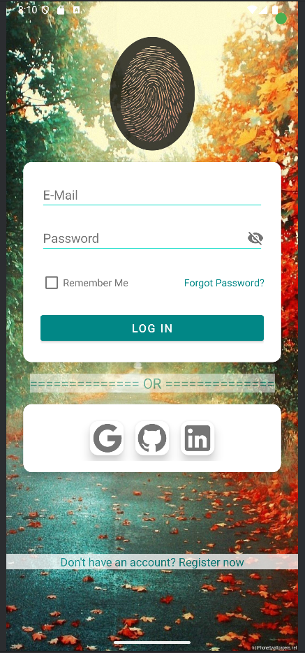

# **HabitGuard**

## Introduction

HabitGuard is a mobile application designed to help users manage their social and financial events
through an intuitive calendar interface. Users can create personalized profiles with custom
authentication, track their daily routines and financial transactions, and receive alerts based on
their habitual patterns. The app provides notifications about account balances, upcoming credits
and debits, and offers financial planning suggestions. Additionally, HabitGuard includes features
for setting reminders for important events and deadlines, ensuring users stay on top of their 
schedules. The app also supports data synchronization across multiple devices, allowing users to
access their information seamlessly. HabitGuard was developed collaboratively using Android 
Studio, Google Firebase, and GitHub.

### Getting Started

##### Requirements
    Current version of Android.
##### Installation

#### Features
* Add, edit, and delete habits
* Add, edit, and delete financial transactions

#### Application Walkthrough
Once the app is installed a user will need to navigate to the bottom of the page to click on the 
Don't have an account? Register now prompt.

