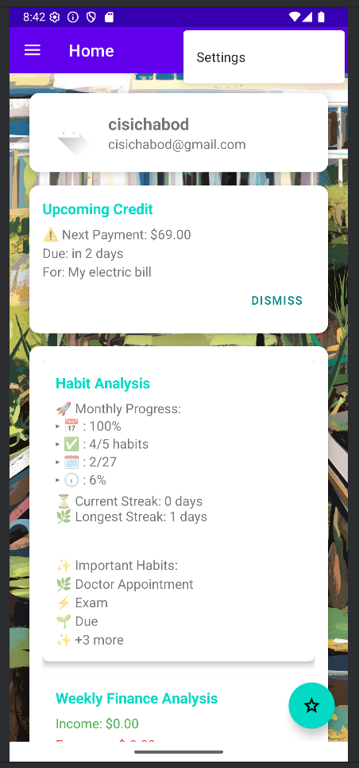

# **HabitGuard**

## Introduction

HabitGuard is a mobile application designed to help users manage their social and financial events
through an intuitive calendar interface. Users can create personalized profiles with custom
authentication, track their daily routines and financial transactions, and receive alerts based on
their habitual patterns. The app provides notifications about account balances, upcoming credits
and debits, and offers financial planning suggestions. Additionally, HabitGuard includes features
for setting reminders for important events and deadlines, ensuring users stay on top of their 
schedules. The app also supports data synchronization across multiple devices, allowing users to
access their information seamlessly. HabitGuard was developed collaboratively using Android 
Studio, Google Firebase, and GitHub.

#### Development Tools
The tools used in the development of this app were Android Studio, Github, and Google Firebase. 
We utilized several supportive tools in development; Trello, YouTube, Gemini, CoPilot, and Stack
Overflow.

#### Requirements
   Latest version of Android OS.
#### Installation

#### Features
* Account Creation with Authentication Tokens: Securely create accounts using
authentication tokens from Google Firebase.
* Password Management: Recover your account with our secure password recovery process.
* User Profile Management: Create and manage personalized user profiles.
* Credential Storage: Remember and securely store user credentials for easy access.
* Habit Management: Add, edit, and delete habits effortlessly.
* Transaction Management: Add, edit, and delete transactions with ease.
* Comprehensive Summary Page: View a detailed summary of habits and transactions.
* Streaks Summary: Track and summarize streaks of activities.
* Insightful Suggestions: Receive personalized suggestions through analysis of habits
and transactions.

  
#### Application Walkthrough
Once the app is installed a user will need to navigate to the bottom of the page to click on the 
Don't have an account? Register now prompt.

The registration screen will ask users to enter an email address, password, and confirm password.
Password requirements include upper case letter, lower case letter, a number, a symbol and 
must be twelve characters long. Once users have email and password entered, they will click the
sign-up button.

The screen will then return to the original login screen where the user will enter their 
newly created login and password. Users can click the Remember me option which will populate 
the saved login and password to make future logins easier.

After hitting the Login button users will see the Home Screen.

To complete their profile information users will need to click the three dots in the 
upper left-hand corner to display the settings button.

Once the user clicks settings they will navigate to the Accounting Settings screen. This screen
contains the Edit Profile button.

The user will be sent to a new screen once the Edit Profile button is clicked.

The user can add name information, birthdate, gender, address, and telephone numbers. 
The user will receive a pop-up notification when entering their gender.

The user will hit the save button at the bottom of the screen once they are done
modify their profile information.

The screen will return to the account settings summary screen where a toast notification will appear
stating the profile has been updated.

The next step is for the user to swipe out of the profile to return to the home screen and then click 
the hamburger in the upper left corner to expand the menu for the Home, Calendar, and Finance menu.

The user can click Calendar which opens the calendar home screen. This screen will 
show the user a calendar of the month and automatically lists the weekly habits below
the calendar. The green arrows on each side of the name of the month allow the user to 
switch to different months. The user can click the Weekly button to change it to a Daily
view. If the user clicks the Daily button it will then switch to an Hourly view for that
day. To enter a habit the user can click the Add Event button below the calendar.

The Add Event screen gives the user several options that can be completed about their 
habit such as, title, time, recurring, location, and description.

The user can check the Recurring Event box which will expand to let the user enter more
information about their habit including repeat frequency;day, week, month, year. A user 
can also set the habit to end after a certain number of occurrences or on a certain date.
Once the user is done entering their information they can hit the Save button at the bottom
of the screen.

To enter transactions the user will click the Add Event button below the Calendar
and then click the Transaction button on the Habit screen. This screen will allow
users to enter a title, amount, time, recurring, tags, location, and description.

The user has an icon to the right of the amount that can be used to identify if the 
transaction is income, debit, or future debit.

Once a user has entered their habits and transactions they can edit or delete both by clicking
on the day and then scrolling down below the calendar to the Habit and Transaction
summary.

